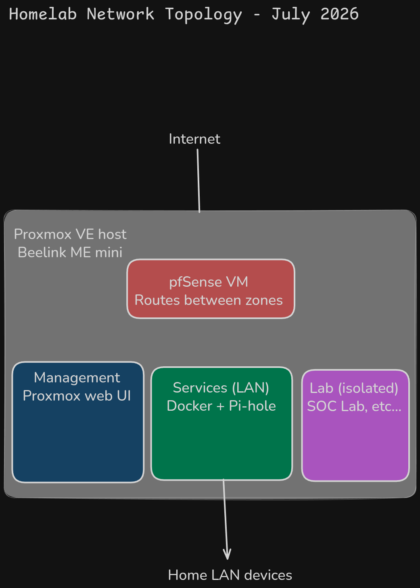

# HomeLab

This repository documents my hands-on learning in building and operating a self-hosted homelab on personal hardware.

The focus is on **understanding infrastructure through practice**, including:

- Linux system administration
- Bare-metal hypervisor management (Proxmox VE)
- VM and LXC container orchestration
- Dockerized self-hosted services
- Networking fundamentals and real-world constraints
- Security hardening for private services

This is not a production environment. It is a learning-focused lab shaped by actual limitations — a single mini PC, ISP-controlled networking equipment, and a household that requires quiet, low-power, always-on-safe hardware.

---

## Recent Changes

- **2026-07:** Phase 1 migration complete — all services migrated from VirtualBox to Proxmox on dedicated hardware (Beelink ME Mini)
- **2026-07:** Pi-hole migrated from Docker container to dedicated LXC (CT 101) at `192.168.100.53` — always-on network-wide DNS
- **2026-07:** Router DNS reconfigured to point to Pi-hole LXC — Pi-hole is now the daily-driver DNS for the entire LAN
- **2026-07:** Homarr migrated from deprecated `ajnart/homarr` to actively maintained `ghcr.io/homarr-labs/homarr:latest` — new image, new volume structure, port 3000 internally
- **2026-07:** SSH hardening applied to both Proxmox host and Docker VM — key-only auth, fail2ban, UFW on both machines
- **2026-07:** IOMMU enabled at kernel level (`intel_iommu=on`) — ready for NIC passthrough to future pfSense VM
- **2026-07:** Old VirtualBox-based Ubuntu Server VM decommissioned
- **2026-06:** Localhost-bind refactor for Audiobookshelf — port bound to `127.0.0.1` only, accessible exclusively via NPM by hostname
- **2026-06:** Phase 0 services deployed — NPM, Pi-hole, Uptime Kuma, Portainer, Homarr
- **2026-05:** VM hardening — SSH key-only auth, fail2ban, UFW; documented in `security/vm-hardening.md`
- **2026-05:** Automated backups — daily Docker volume + config backups, restore-tested
- **2026-05:** GitOps workflow adopted — repo as source of truth
- **2026-03:** SOC lab built — Wazuh + Kali + Metasploitable2, attack/detect loop verified

---

## Current State

**Phase:** 1 — Infrastructure Migration *(core migration complete, snapshots/templates/backups remaining)*

### Infrastructure

| Component | Role | Details |
|-----------|------|---------|
| **Beelink ME Mini** | Proxmox host | Intel N150, 16GB LPDDR5, 1TB NVMe, dual 2.5GbE, Proxmox VE 9.2 at `192.168.100.10` |
| **VM 100 (docker-host)** | Docker services | Ubuntu 24.04.4, 2 cores, 7GB RAM, 200GB disk at `192.168.100.50` |
| **CT 101 (pihole)** | Network DNS | LXC container, Pi-hole at `192.168.100.53`, router DNS points here |
| **Sandbox box** | Lab/learning | i5-3470 desktop, 8GB RAM, no storage yet — awaiting SSD for Proxmox install |

### Live Services (Docker VM at `192.168.100.50`)

- **Audiobookshelf** — audiobook server, localhost-bound (`:13378`), accessible via NPM reverse proxy
- **Nginx Proxy Manager** — reverse proxy, routes by hostname, admin on `:81`
- **Uptime Kuma** — 8 monitors + Telegram alerts covering all services, DNS, and Proxmox
- **Portainer** — visual Docker management UI on `:9443`
- **Homarr** — dashboard landing page on `:7575`, links to all services

### Standalone Services

- **Pi-hole** (LXC) — network-wide DNS + ad-blocking at `192.168.100.53`, always-on
- **SOC Lab** — Wazuh SIEM + Kali + Metasploitable2, isolated network (currently on separate VirtualBox setup, migration to Proxmox planned)

### Security

- Both Proxmox host and Docker VM hardened: SSH key-only auth, root login disabled, fail2ban (24h bans), UFW default-deny inbound
- IOMMU enabled for future PCI passthrough (pfSense VM NIC passthrough)
- Docker/UFW bypass partially addressed (Audiobookshelf localhost-bound; remaining services on the TODO)

---

## Repository Structure

```
homelab/
├── README.md
├── .gitignore
├── docs/
│   ├── TODO.md
│   ├── workstation-setup.md
│   ├── HomeLab-NetworkTopologyV2.png
│   └── HomeLab-NetworkTopologyV2.excalidraw
├── scripts/
│   ├── backup-homelab.sh
│   └── backups.md
├── security/
│   ├── vm-hardening.md
│   └── soc-lab/
│       ├── README.md
│       └── [screenshots]
└── services/
    ├── audiobookshelf/
    │   ├── Audiobookshelf.md
    │   └── docker-compose.yml
    ├── nginx-proxy-manager/
    │   ├── NginxProxyManager.md
    │   └── docker-compose.yml
    ├── homarr/
    │   ├── Homarr.md
    │   ├── docker-compose.yml
    │   └── screenshots/
    ├── portainer/
    │   ├── Portainer.md
    │   └── docker-compose.yml
    └── uptime-kuma/
        ├── UptimeKuma.md
        ├── docker-compose.yml
        └── screenshots/
```

---

## Network Topology



Source file: [docs/HomeLab-NetworkTopologyV2.excalidraw](docs/HomeLab-NetworkTopologyV2.excalidraw)

---

## Services

### Audiobookshelf

Self-hosted audiobook server. Bound to `127.0.0.1:13378` — only reachable through NPM reverse proxy by hostname, closing the Docker/UFW bypass for this service.

→ [Audiobookshelf.md](services/audiobookshelf/Audiobookshelf.md)

### Nginx Proxy Manager

Reverse proxy routing homelab services by hostname instead of `IP:port`. Web admin on `:81`.

→ [NginxProxyManager.md](services/nginx-proxy-manager/NginxProxyManager.md)

### Pi-hole

Network-wide DNS server + ad/tracker blocking. Runs as a dedicated LXC container (CT 101) at `192.168.100.53`. Router DNS points here — Pi-hole is the daily-driver DNS for the entire LAN.

→ [Pihole.md](services/pihole/Pihole.md)

### Uptime Kuma

Monitoring + alerting. 8 monitors covering each service, DNS resolution, Proxmox host, and an external dependency. Sends alerts to Telegram.

→ [UptimeKuma.md](services/uptime-kuma/UptimeKuma.md)

### Portainer

Visual container management UI. CLI complement, not replacement. Useful for inspecting container state, logs, and demoing the stack.

→ [Portainer.md](services/portainer/Portainer.md)

### Homarr

Single dashboard landing page for the homelab. All services linked from one URL.

→ [Homarr.md](services/homarr/Homarr.md)

### SOC Security Lab

Home-built Security Operations Center lab using Wazuh SIEM, Kali Linux and Metasploitable2. Simulates real attack scenarios and detects them using MITRE ATT&CK framework mapping.

→ [SOC Lab](security/soc-lab/README.md)

---

## Infrastructure

### Proxmox Host (Beelink ME Mini)

Dedicated always-on mini PC running Proxmox VE 9.2 bare-metal. Chosen for low power draw, fanless-quiet operation, and dual 2.5GbE NICs (one reserved for future pfSense NIC passthrough).

- **Hardware:** Intel N150, 16GB LPDDR5 (soldered), 1TB NVMe, dual Intel i226-V 2.5GbE
- **Host IP:** `192.168.100.10`
- **Web UI:** `https://192.168.100.10:8006`
- **VT-x/VT-d:** Enabled (BIOS + kernel-level `intel_iommu=on`)
- **SSH hardened:** key-only auth, fail2ban, UFW (ports 22, 8006 only)

### Docker VM (VM 100)

Ubuntu Server 24.04.4 running all Docker-based services. Migrated from the old VirtualBox-based setup with volume export/import.

- **Specs:** 2 cores, 7GB RAM, 200GB VirtIO disk
- **IP:** `192.168.100.50` (static via netplan)
- **SSH hardened:** key-only auth, fail2ban, UFW with per-service port rules
- **Guest agent:** qemu-guest-agent installed, Proxmox can see VM IP and do clean shutdowns

### Pi-hole LXC (CT 101)

Lightweight LXC container running Pi-hole for network-wide DNS. Separated from the Docker stack so DNS survives Docker VM reboots/maintenance independently.

- **IP:** `192.168.100.53`
- **Router configured:** LAN DHCP pushes `.53` as primary DNS to all devices

### Sandbox Box (i5-3470)

Secondary disposable lab machine for hands-on networking practice (CCNA, GNS3/EVE-NG). Purchased for €35, confirmed POST and VT-x support. Awaiting SSD purchase before Proxmox can be installed. Not connected to or trusted by the production Beelink — fully separate by design.

→ [workstation-setup.md](docs/workstation-setup.md)

---

## Workflow

The repo is the source of truth, not the running services.

- All edits happen on the host desktop in Git
- Commits get pushed to GitHub
- The Docker VM clones the same repo and pulls to deploy (`git pull` + `docker compose up -d`)
- Nothing is configured directly on the VM — if it's not in Git, it doesn't exist
- Infrastructure-level changes (Proxmox host, LXC config) are documented here even if not deployed via Git directly

---

## Core Rules

1. **Every new technology must solve a problem created by the previous phase.** No tutorial addiction.
2. **If you can't explain WHY a service exists in one sentence, don't deploy it yet.**
3. **Exit checkpoints gate each phase, not time.** A phase ends when its goals are met, not when six weeks pass.
4. **Break/fix drills regularly.** Deliberately break something, diagnose it, document the recovery.
5. **Everything in Git with meaningful commits.** No hand-typed `docker run` commands.
6. **GUI tools are for observability, not for hiding CLI knowledge.** Portainer is fine; not knowing what `docker ps` does isn't.
7. **The homelab is the gym, not the competition.** Production-grade habits, not production-grade scale.

### Things deliberately NOT touched yet
- Kubernetes — Docker + Linux mastery first
- Multi-node clustering — operational maturity on one node before scaling
- Heavy cloud focus (AWS/Azure) — local infrastructure pain teaches WHY cloud exists
- Terraform before Ansible — Ansible is simpler and more immediately useful
- WireGuard — Tailscale already covers secure remote access; deploying WireGuard now would be tutorial addiction

---

## Roadmap

A 5-phase plan, gated by exit checkpoints rather than time. Detailed phase checklists at [strma77.github.io](https://strma77.github.io/).

### Phase 0 — Foundation Hardening ✅ Complete
**Goal:** Build deep Docker Compose + Linux administration fluency before adding any new technology.

All services deployed in Compose with healthchecks, in Git, backed up, hardened. Break/fix drills executed. Can recover any container without Googling.

### Phase 1 — Infrastructure Migration (current)
**Goal:** Stop being someone who runs services and start being someone who builds infrastructure.

- **Done:** Proxmox on dedicated hardware, Docker VM migrated, Pi-hole LXC deployed, SSH hardening on all machines, IOMMU enabled
- **Remaining:** Snapshots, VM templates, automated Proxmox backups, pfSense VM, VLAN segmentation, repo documentation sync
- **Exit:** New VM from template in under 5 minutes. VLANs isolate traffic. SOC lab on its own VLAN. Network topology diagram up to date.

### Phase 2 — Monitoring + Automation
**Goal:** Stop being the manual layer. Get observability and automate the repetitive.

- **Adding:** Prometheus, Grafana, Loki, Node Exporter, Ansible, Gitea, expanded SOC lab
- **Exit:** Find out about problems from alerts, not by noticing. New VM provisioning is an Ansible playbook.

### Phase 3 — Advanced Networking + DevOps
**Goal:** Junior infrastructure engineer skill set. CI/CD, internal PKI, infrastructure-as-code as a daily habit.

- **Adding:** Traefik, Step-CA, Suricata IDS/IPS, GitHub/Gitea Actions, self-hosted runners, Terraform for Proxmox
- **Exit:** Push code, watch it deploy. Internal HTTPS with own CA. Infrastructure changes go through Git.

### Phase 4 — AI Integration + MLOps
**Goal:** AI as a tool integrated into existing infrastructure, not a standalone toy.

- **Adding:** Ollama with GPU passthrough, Open WebUI, RAG over homelab docs, log analysis from Loki
- **Exit:** Local LLM woven into the stack. Can articulate inference vs RAG vs fine-tuning from hands-on experience.

---

## Philosophy

- Learn by building under real constraints
- Document failures and fixes, not just commands
- Make architectural decisions explicit and reproducible
- Build skills transferable to real infrastructure roles
