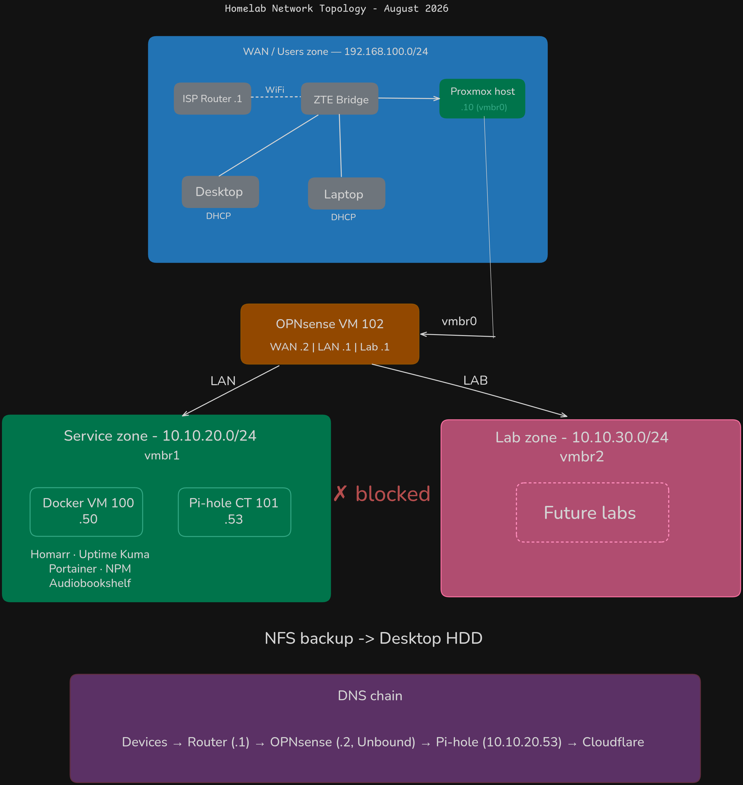

# HomeLab

This repository documents my hands-on learning in building and operating a self-hosted homelab on personal hardware.

The focus is on **understanding infrastructure through practice**, including:

- Linux system administration
- Bare-metal hypervisor management (Proxmox VE)
- VM and LXC container orchestration
- Dockerized self-hosted services
- Network segmentation with a virtual firewall (OPNsense)
- Security hardening for private services

This is not a production environment. It is a learning-focused lab shaped by actual limitations — a single mini PC, ISP-controlled networking equipment, and a household that requires quiet, low-power, always-on-safe hardware.

---

## Recent Changes

- **2026-08:** Network segmentation deployed — OPNsense VM routing between WAN/Users, Services, and Lab zones
- **2026-08:** Docker VM and Pi-hole LXC migrated from flat network to Services zone (`10.10.20.0/24`)
- **2026-08:** DNS chain reconfigured: devices → router → OPNsense (Unbound) → Pi-hole → upstream DNS
- **2026-08:** Lab zone (`10.10.30.0/24`) created with firewall rules blocking access to Services zone
- **2026-08:** NFS backup storage configured from desktop HDD with soft mount options
- **2026-08:** Automated Proxmox backups — daily ZSTD to NFS, 3-backup retention
- **2026-08:** VM templates and snapshots — Ubuntu 24.04 template, full snapshot lifecycle tested
- **2026-07:** Phase 1 migration — all services migrated from VirtualBox to Proxmox on Beelink ME Mini
- **2026-07:** Pi-hole migrated from Docker to dedicated LXC container — always-on DNS
- **2026-07:** Homarr migrated from deprecated `ajnart/homarr` to `ghcr.io/homarr-labs/homarr:latest`
- **2026-07:** SSH hardening on Proxmox host and Docker VM — key-only auth, fail2ban, UFW
- **2026-06:** Phase 0 services deployed and hardened
- **2026-03:** SOC lab built — Wazuh + Kali + Metasploitable2

---

## Current State

**Phase:** 1 — Infrastructure Migration *(network segmentation live, two exit checkpoints remaining)*

### Infrastructure

| Component | Role | Zone | IP |
|-----------|------|------|----|
| **Beelink ME Mini** | Proxmox host | WAN/Users | `192.168.100.10` |
| **VM 102 (opnsense)** | Firewall/Router | All zones | WAN: `192.168.100.2`, LAN: `10.10.20.1`, Lab: `10.10.30.1` |
| **VM 100 (docker-host)** | Docker services | Services | `10.10.20.50` |
| **CT 101 (pihole)** | Network DNS | Services | `10.10.20.53` |
| **VM 900 (template)** | Ubuntu 24.04 template | — | — |
| **Sandbox box** | Lab/learning | Not connected | Awaiting SSD |

### Network Zones

| Zone | Subnet | Bridge | Purpose |
|------|--------|--------|---------|
| WAN/Users | `192.168.100.0/24` | vmbr0 | ISP router, desktop, laptop, Proxmox management |
| Services | `10.10.20.0/24` | vmbr1 | Docker VM, Pi-hole — production services |
| Lab | `10.10.30.0/24` | vmbr2 | Isolated — SOC lab, testing, future sandbox |

### DNS Chain

```
All devices → ISP Router (.1) → OPNsense (.2, Unbound) → Pi-hole (10.10.20.53) → Cloudflare (1.1.1.1)
```

Pi-hole filters ads/trackers at the DNS level. OPNsense's Unbound forwards to Pi-hole. Router DHCP pushes OPNsense as primary DNS to all clients.

### Live Services (Docker VM at `10.10.20.50`)

- **Audiobookshelf** — audiobook server, localhost-bound (`:13378`), accessible via NPM reverse proxy
- **Nginx Proxy Manager** — reverse proxy, routes by hostname, admin on `:81`
- **Uptime Kuma** — 8 monitors + Telegram alerts covering all services, DNS, and Proxmox
- **Portainer** — visual Docker management UI on `:9443`
- **Homarr** — dashboard landing page on `:7575`, links to all services

### Standalone Services

- **OPNsense** (VM) — firewall/router, network segmentation between zones
- **Pi-hole** (LXC) — network-wide DNS + ad-blocking at `10.10.20.53`, always-on
- **SOC Lab** — Wazuh SIEM + Kali + Metasploitable2 (currently on separate VirtualBox setup, migration to Lab zone planned)

### Security

- Proxmox host and Docker VM: SSH key-only auth, root login disabled, fail2ban, UFW
- OPNsense firewall rules: Users can reach Services on specific ports. Lab zone blocked from Services. Lab can reach internet only.
- DNS filtered through Pi-hole for all network clients
- IOMMU enabled for future PCI passthrough

---

## Repository Structure

```
homelab/
├── README.md
├── .gitignore
├── docs/
│   ├── TODO.md
│   ├── workstation-setup.md
│   └── [network topology diagrams]
├── infrastructure/
│   └── opnsense.md
├── scripts/
│   ├── backup-homelab.sh
│   └── backups.md
├── security/
│   ├── vm-hardening.md
│   └── soc-lab/
│       ├── README.md
│       └── [screenshots]
└── services/
    ├── audiobookshelf/
    ├── nginx-proxy-manager/
    ├── homarr/
    ├── portainer/
    └── uptime-kuma/
```

---

## Network Topology



Source file: [docs/HomeLab-NetworkTopologyV3.excalidraw](docs/HomeLab-NetworkTopologyV3.excalidraw)

---

## Services

### Audiobookshelf
Self-hosted audiobook server. Bound to `127.0.0.1:13378` — only reachable through NPM reverse proxy.
→ [Audiobookshelf.md](services/audiobookshelf/Audiobookshelf.md)

### Nginx Proxy Manager
Reverse proxy routing homelab services by hostname. Admin on `:81`.
→ [NginxProxyManager.md](services/nginx-proxy-manager/NginxProxyManager.md)

### Pi-hole
Network-wide DNS + ad-blocking. LXC container (CT 101) at `10.10.20.53`. DNS chain: router → OPNsense → Pi-hole → upstream.

### Uptime Kuma
Monitoring + alerting. 8 monitors covering all services, DNS, and Proxmox. Telegram alerts.
→ [UptimeKuma.md](services/uptime-kuma/UptimeKuma.md)

### Portainer
Visual container management UI on `:9443`.
→ [Portainer.md](services/portainer/Portainer.md)

### Homarr
Dashboard landing page. All services linked from one URL at `:7575`.
→ [Homarr.md](services/homarr/Homarr.md)

### OPNsense
Virtual firewall/router. Routes and filters traffic between WAN/Users, Services, and Lab zones.
→ [opnsense.md](infrastructure/opnsense.md)

### SOC Security Lab
Wazuh SIEM + Kali + Metasploitable2. Attack/detect loop verified with MITRE ATT&CK mapping.
→ [SOC Lab](security/soc-lab/README.md)

---

## Infrastructure

### Proxmox Host (Beelink ME Mini)
- **Hardware:** Intel N150, 16GB LPDDR5, 1TB NVMe, dual 2.5GbE
- **Host IP:** `192.168.100.10`
- **Web UI:** `https://192.168.100.10:8006`
- **VT-x/VT-d:** Enabled
- **SSH hardened:** key-only, fail2ban, UFW (22, 8006)
- **Bridges:** vmbr0 (WAN, physical NIC), vmbr1 (Services, virtual), vmbr2 (Lab, virtual)

### OPNsense VM (VM 102)
- **Specs:** 1 core, 2GB RAM, 16GB disk, OPNsense 26.7
- **WAN:** `192.168.100.2/24` on vmbr0, gateway `192.168.100.1`
- **LAN (Services):** `10.10.20.1/24` on vmbr1
- **Lab:** `10.10.30.1/24` on vmbr2
- **Web UI:** `https://192.168.100.2`
- **DNS:** Unbound forwarding to Pi-hole (`10.10.20.53`)
→ [opnsense.md](infrastructure/opnsense.md)

### Docker VM (VM 100)
- **Specs:** 2 cores, 7GB RAM, 200GB disk, Ubuntu 24.04.4
- **IP:** `10.10.20.50` on vmbr1 (Services zone)
- **SSH:** `ssh docker` → `strma@10.10.20.50`
- **Hardened:** key-only, fail2ban, UFW

### Pi-hole LXC (CT 101)
- **Specs:** 1 core, 512MB RAM, 8GB disk
- **IP:** `10.10.20.53` on vmbr1 (Services zone)
- **Web UI:** `http://10.10.20.53/admin`

### Sandbox Box (i5-3470)
Disposable lab machine. €35, VT-x confirmed. Awaiting SSD.
→ [workstation-setup.md](docs/workstation-setup.md)

---

## Workflow

The repo is the source of truth, not the running services.

- All edits happen on the host desktop in Git
- Docker VM pulls to deploy (`git pull` + `docker compose up -d`)
- Infrastructure-level changes (Proxmox, OPNsense, LXC) documented here even if not deployed via Git
- Desktop and laptop have persistent static routes to Services (`10.10.20.0/24`) and Lab (`10.10.30.0/24`) via OPNsense (`192.168.100.2`)

---

## Core Rules

1. **Every new technology must solve a problem created by the previous phase.** No tutorial addiction.
2. **If you can't explain WHY a service exists in one sentence, don't deploy it yet.**
3. **Exit checkpoints gate each phase, not time.**
4. **Break/fix drills regularly.**
5. **Everything in Git with meaningful commits.**
6. **GUI tools are for observability, not for hiding CLI knowledge.**
7. **The homelab is the gym, not the competition.**

---

## Roadmap

Detailed phase checklists at [strma77.github.io](https://strma77.github.io/).

### Phase 0 — Foundation Hardening ✅ Complete
### Phase 1 — Infrastructure Migration (current)
- **Done:** Proxmox, Docker VM, Pi-hole LXC, OPNsense, network segmentation, backups, templates
- **Remaining:** Tighten firewall rules, test Lab isolation, update topology diagram
### Phase 2 — Monitoring + Automation
### Phase 3 — Advanced Networking + DevOps
### Phase 4 — AI Integration + MLOps
