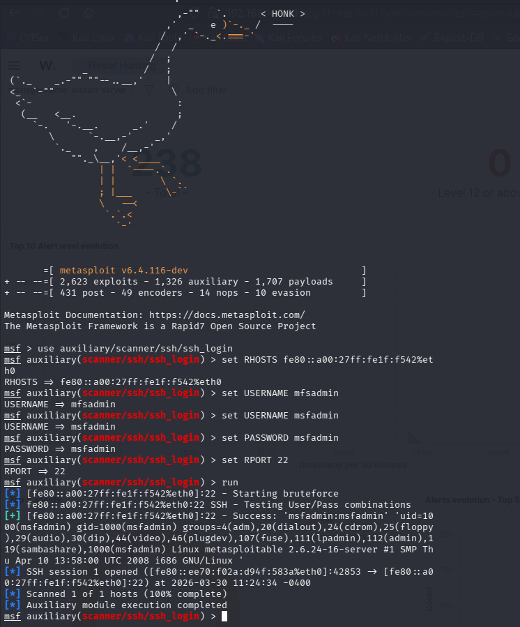
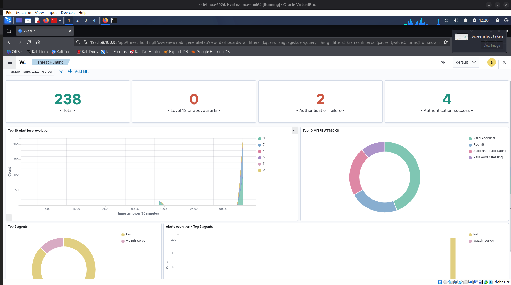
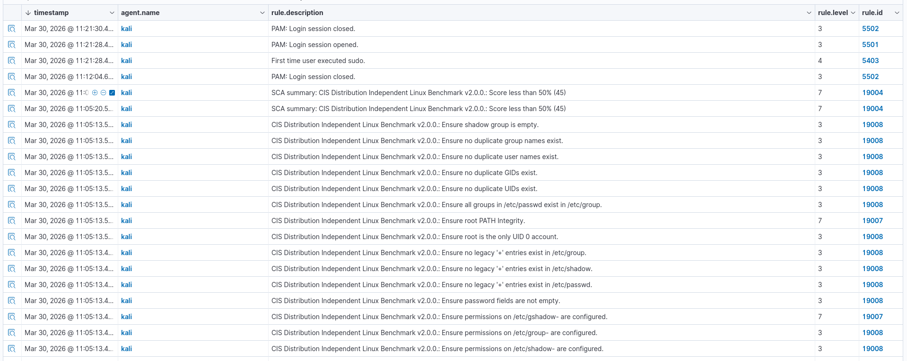

# SOC Home Lab — Build Documentation

> **Author:** Vito Strmečki
> **Date:** March 30, 2026  
> **Host OS:** Ubuntu 25.10  
> **Hypervisor:** Oracle VirtualBox  

---

## Overview

Built a functional Security Operations Center (SOC) lab from scratch on a personal machine using free, open-source tools. The goal: simulate a real attack scenario and detect it using a SIEM — the core workflow of any SOC analyst.

**The lab consists of three virtual machines:**

| VM | Role | IP |
|---|---|---|
| Wazuh v4.14.4 (OVA) | SIEM / Detection | 192.168.100.93 |
| Kali Linux 2026.1 | Attacker machine + monitored agent | 192.168.100.20 |
| Metasploitable2 (Victim) | Intentionally vulnerable target | 192.168.100.10 |

---

## Host Machine Specs

- **CPU:** AMD Ryzen 7 3700X
- **RAM:** 32GB DDR4 3200MHz
- **Storage:** 500GB NVMe SSD (319GB free)
- **GPU:** RTX 2060 Super
- **OS:** Ubuntu 25.10

---

## Network Architecture

All three VMs are connected via a VirtualBox **Internal Network** named `labnet`. This creates an isolated network segment with no external internet access by default.

```
┌─────────────────────────────────────────┐
│           labnet (192.168.100.0/24)     │
│                                         │
│  ┌──────────┐    ┌──────────────────┐   │
│  │  Wazuh   │    │   Metasploitable │   │
│  │ .93      │    │   .10 (Victim)   │   │
│  └──────────┘    └──────────────────┘   │
│        ▲                  ▲             │
│        │                  │             │
│  ┌─────┴──────────────────┴──────────┐  │
│  │         Kali Linux .20            │  │
│  │   (Attacker + Wazuh Agent)        │  │
│  └───────────────────────────────────┘  │
└─────────────────────────────────────────┘
         │
    eth1 (NAT) → Internet
```

**Kali has two network adapters:**
- `eth0` — Internal Network (labnet) → reaches Metasploitable and Wazuh
- `eth1` — NAT → internet access for package installation

---

## VM Setup

### 1. Wazuh SIEM

- Downloaded the official Wazuh OVA (v4.14.4)
- Imported directly into VirtualBox via **File → Import Appliance**
- Network adapter set to Internal Network (`labnet`)
- Wazuh auto-assigned IP: `192.168.100.93`
- Web dashboard accessible at `https://192.168.100.93`
- Default credentials: `admin / admin`

**Issue encountered:** On first boot, VirtualBox showed "No hard disk selected for IDE controller." Fixed by checking Storage settings and confirming the OVA disk was properly attached under SATA controller.

---

### 2. Kali Linux (Attacker)

- Downloaded Kali Linux VirtualBox image (kali-linux-2026.1-virtualbox-amd64)
- Extracted `.7z` archive, added VM via **File → Add** pointing to the `.vbox` file
- Default credentials: `kali / kali`

**Network configuration:**
- Adapter 1: Internal Network (`labnet`)
- Adapter 2: NAT (for internet access)

**Issue encountered:** `ifconfig` command misapplied the static IP, showing `255.255.255.255` instead of the intended address. Fixed using the `ip` command:

```bash
sudo ip addr flush eth0
sudo ip addr add 192.168.100.20/24 dev eth0
sudo ip link set eth0 up
```

> **Note:** Static IP assignment resets on reboot. Re-run the above commands after each reboot, or configure a persistent static IP in `/etc/network/interfaces`.

---

### 3. Metasploitable2 (Victim)

- Downloaded Metasploitable2 ZIP (~865MB) from SourceForge
- Extracted archive containing `.vmdk`, `.vmx`, `.nvram`, `.vmsd` files
- Created new VM in VirtualBox manually:
  - Type: Linux
  - Version: Other Linux (32-bit)
  - RAM: 512MB
  - Hard disk: attached existing `.vmdk` file
- Default credentials: `msfadmin / msfadmin`
- Static IP assigned: `192.168.100.10`

**Issue encountered:** VM failed to boot initially — "No bootable medium found." Root cause: VirtualBox was looking at the wrong storage controller. Fixed by going to Settings → Storage and manually attaching the `.vmdk` under the SATA controller instead of IDE.

**Issue encountered:** VirtualBox file picker filtered out `.vmdk` files. Fixed by changing the filter dropdown from "Hard disk files" to "All files."

---

## Wazuh Agent Installation (Kali)

Since Metasploitable2 runs Ubuntu 8.04 (end of life), it cannot run a modern Wazuh agent. The agent was installed on Kali instead, which acts as both the attacker and a monitored endpoint.

```bash
# Add Wazuh GPG key
curl -s https://packages.wazuh.com/key/GPG-KEY-WAZUH | gpg --dearmor | sudo tee /usr/share/keyrings/wazuh.gpg > /dev/null

# Add repository
echo "deb [signed-by=/usr/share/keyrings/wazuh.gpg] https://packages.wazuh.com/4.x/apt/ stable main" | sudo tee /etc/apt/sources.list.d/wazuh.list

# Install agent
sudo apt update && sudo apt install wazuh-agent -y
```

**Configure agent to report to Wazuh server:**

```bash
sudo nano /var/ossec/etc/ossec.conf
# Set <address>192.168.100.93</address>
```

**Start and enable agent:**

```bash
sudo systemctl daemon-reload
sudo systemctl enable wazuh-agent
sudo systemctl start wazuh-agent
sudo systemctl status wazuh-agent
```

**Result:** Agent status `active (running)`. Kali appears in Wazuh dashboard under Endpoints as agent ID `001`, status **Active**.

---

## Connectivity Verification

```bash
# From Kali — confirm Metasploitable is reachable
ping 192.168.100.10        # ✅ replies

# From Kali — confirm internet access
ping 8.8.8.8               # ✅ replies

# From Kali — confirm Wazuh is reachable
ping 192.168.100.93        # ✅ replies
```

---

## First Reconnaissance Scan

Ran an nmap service version scan from Kali against Metasploitable:

```bash
nmap -sV 192.168.100.10
```

**Results — open ports detected:**

| Port | Service | Version |
|------|---------|---------|
| 21 | FTP | vsftpd 2.3.4 |
| 22 | SSH | OpenSSH 4.7p1 |
| 23 | Telnet | Linux telnetd |
| 25 | SMTP | Postfix |
| 80 | HTTP | Apache 2.2.8 |
| 3306 | MySQL | 5.0.51a |
| 5432 | PostgreSQL | 8.3.7 |
| 5900 | VNC | protocol 3.3 |
| 1524 | Bindshell | Metasploitable root shell |
| 6667 | IRC | UnrealIRCd |

Metasploitable exposes an intentional root shell on port 1524 and multiple known vulnerable service versions — ideal for attack/detect exercises.

---

## IPv4 vs IPv6 Binding Issue (Troubleshooting)

After confirming ping worked between Kali and Metasploitable over IPv4, all nmap scans against `192.168.100.10` returned all ports as `filtered` — even with iptables showing no blocking rules (`policy ACCEPT` on all chains).

**Root cause:** Metasploitable2 runs Ubuntu 8.04, an extremely old kernel. Its services bind to IPv6 by default (`:::22`, `:::80` etc.) rather than IPv4 (`0.0.0.0`). This is visible in the `netstat -tlnp` output where all listening services show `tcp6` instead of `tcp`.

```
tcp6    0    0 :::22     :::*    LISTEN
tcp6    0    0 :::80     :::*    LISTEN
```

Since Kali was scanning over IPv4, it couldn't reach services that were only listening on IPv6 — even though the host itself was reachable via ping (ICMP works differently).

**Debugging steps taken:**
```bash
# Confirmed iptables not blocking
sudo iptables -L         # all chains policy ACCEPT, no rules

# Confirmed services running but on IPv6
netstat -tlnp            # all services on tcp6

# Confirmed IPv6 scanning works
nmap -6 -sT -p 22,23,80 fe80::a00:27ff:fe1f:f542%eth0
# Result: port 22 open, others closed
```

**Resolution:** Attack traffic directed over IPv6 using Metasploitable's link-local address:

```
fe80::a00:27ff:fe1f:f542%eth0
```

**Lesson learned:** Always check whether services are binding to IPv4, IPv6, or both. A host that responds to ping but shows all ports filtered on nmap is almost always a protocol mismatch — not a firewall issue. `netstat -tlnp` is your first diagnostic tool in this scenario.

---

## Attack Execution & Detection

### Tool: Metasploit Framework

Metasploit is the industry standard exploitation framework used by both penetration testers and real attackers. It was used here to simulate an SSH brute force attack against Metasploitable.

**Why Metasploit over Hydra:** Hydra does not support IPv6 link-local addresses for SSH — it throws an "Invalid argument" error when attempting to bind to a `%eth0` scoped address. Metasploit's `ssh_login` module handles this correctly.

### SSH Login Attack

```bash
msfconsole

use auxiliary/scanner/ssh/ssh_login
set RHOSTS fe80::a00:27ff:fe1f:f542%eth0
set USERNAME msfadmin
set PASSWORD msfadmin
set RPORT 22
run
```

**Result:**
```
[+] Success: 'msfadmin:msfadmin'
SSH session 1 opened ([fe80::ee70:f02a:d94f:583a%eth0]:42853 -> [fe80::a00:27ff:fe1f:f542%eth0]:22)
```

Full SSH session established on Metasploitable. From an attacker's perspective — complete system compromise.



---

### Wazuh Detection Results

Immediately after the attack, Wazuh dashboard showed:

| Metric | Value |
|--------|-------|
| Total alerts | 238 |
| Authentication failures | 2 |
| Authentication successes | 4 |
| MITRE ATT&CK techniques detected | Password Guessing, Valid Accounts, Rootkit, Sudo Caching |

**Timeline spike** visible at the exact timestamp of the attack (11:24 EDT).

**MITRE ATT&CK mappings detected:**
- **T1110 — Password Guessing:** Wazuh flagged the SSH login attempts as a brute force pattern
- **T1078 — Valid Accounts:** Flagged because the attack ultimately succeeded with real credentials

The MITRE ATT&CK framework is a globally recognized knowledge base of adversary techniques. Wazuh automatically maps detected events to these techniques — exactly what SOC analysts use to classify and respond to incidents in real environments.





---

### What This Demonstrates

The full attack chain was successfully simulated and detected:

```
Reconnaissance (nmap) → Exploitation (Metasploit ssh_login) → Detection (Wazuh alert)
```

This mirrors a real security incident workflow:
1. Attacker performs recon to identify open services
2. Attacker exploits weak credentials via SSH
3. SIEM detects authentication anomalies and raises alerts
4. SOC analyst investigates the flagged events

---

## Current Lab Status

| Component | Status |
|-----------|--------|
| Wazuh SIEM | ✅ Running |
| Kali Linux | ✅ Running |
| Wazuh Agent on Kali | ✅ Active |
| Metasploitable2 | ✅ Running |
| Network connectivity | ✅ Verified |
| SSH brute force attack | ✅ Executed |
| Wazuh detection | ✅ Confirmed |
| pfSense/OPNsense firewall | ⬜ Pending |

---

## Next Steps

- [x] Run first attack from Kali (SSH brute force via Metasploit)
- [x] Verify Wazuh detects and alerts on the attack
- [ ] Run additional attack scenarios (FTP, VNC, Bindshell on port 1524)
- [ ] Write custom Wazuh detection rules
- [ ] Deploy OPNsense VM as network firewall/gateway
- [ ] Configure VLAN segmentation via OPNsense
- [ ] Document attack scenarios with screenshots

---

## Key Takeaways

- VirtualBox Internal Network requires manual static IP assignment — no DHCP
- Modern Wazuh agents are incompatible with Ubuntu 8.04 (Metasploitable)
- A dual-adapter setup on Kali is essential: one for the isolated lab network, one for internet access
- Metasploitable2 exposes a deliberately broken attack surface — perfect for practicing detection
- Always check IPv4 vs IPv6 service binding when nmap shows filtered ports despite ping working — `netstat -tlnp` is the first diagnostic tool
- Hydra does not support IPv6 link-local addresses for SSH — use Metasploit's `ssh_login` module instead
- Wazuh automatically maps events to MITRE ATT&CK techniques — the same framework used in real SOC environments
- The full attack/detect loop (recon → exploit → alert) can be simulated on a single machine with free tools
